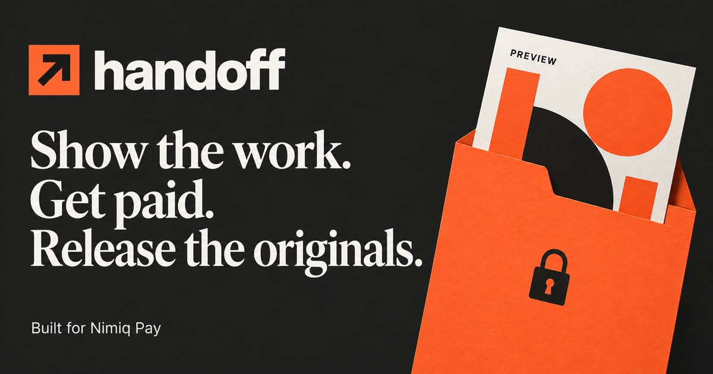

# Handoff frontend

React/TypeScript interface for preparing and reviewing freelancer deliveries. The workspace shows the connected wallet's saved handoffs. A separate, clearly labelled example is available through How it works; it accepts no payment and serves no original file.

## Run

Use Node.js 24.15 or newer. Run `npm ci` and `npm run dev`, then open `http://localhost:5173`. Start the sibling backend separately on port 4003. The frontend proxies `/api` to it; it has no secrets or API credentials. NIM connection requires the Nimiq Pay injected provider; Polygon sign-in uses an EIP-1193 provider. Actual wallet flows remain a device-test gate.

## Build and checks

`npm test` runs focused tests with two Vitest workers. `npm run build` runs the TypeScript check then emits the static site under `dist`. `npm run typecheck` checks types only. Fonts are bundled locally. Responsive rules and reduced-motion support are included; visual/browser accessibility verification is still pending.

The frontend can install and build independently from its branch: the versioned contract archive lives in `vendor/` and is produced from the backend-owned package. Do not edit another schema copy here.

For hosting, use SPA fallback for `/h/*`, `/draft/*`, `/example/*`, `/purchases` and `/how-it-works`, and proxy `/api/*` to the backend on the same origin. This is not deployment approval. See the [main README](https://github.com/appdever01/handoff/blob/main/README.md) for release limits.

The current continuation adds pairing QR/phrase approval and revocation, a clearly labelled local demo identity switcher, test-only wallet checkout, payment recovery, receipts, purchases, downloads and support requests. Supplied previews for editable source files are available in creator tools. The [main README](https://github.com/appdever01/handoff/blob/main/README.md) describes local demo setup. The `/pair` and `/pair/*` routes also require SPA fallback. Browser/device accessibility checks remain unverified.

## Brand assets and social previews

`public/og-image.jpg` is the 1200 × 630 README cover and social preview. `index.html` includes Open Graph and Twitter card metadata using the main address, `https://handoff-nimq.vercel.app`. Shared delivery pages use the same public brand artwork; client files and delivery details are not embedded in social metadata.

`public/favicon.svg` adapts the existing two-arrow mark in forest green and lime. `favicon.ico` includes 16, 32, and 48 pixel fallbacks; `favicon-32x32.png` and `apple-touch-icon.png` provide standalone PNG exports. Vite copies these files into the build without importing them into application code.

If the main hostname changes, update both image URLs in `index.html`. For GitHub's repository social preview, upload `public/og-image.jpg` in the repository's General settings; website metadata does not configure GitHub's preview. The cover was made with built-in image generation; the favicon adapts the app's existing arrows.
